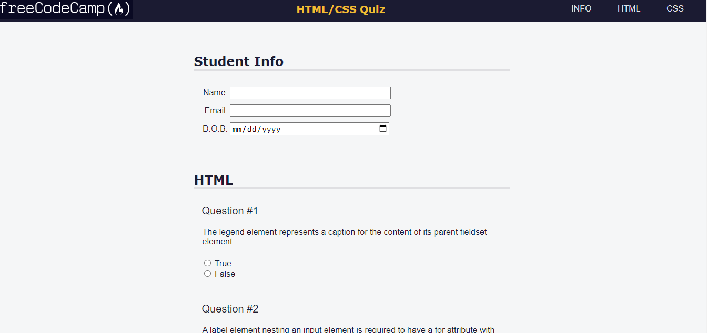

# Accessibility Quiz

This project is an accessibility quiz built as a practice project for freeCodeCamp. It tests your knowledge of HTML and CSS accessibility concepts. The quiz consists of multiple-choice questions and a form to collect student information.

## Preview

# Table of Contents

Getting Started
Features
Technologies Used
Usage
Contributing
License

## Getting Started

To get started with the Accessibility Quiz, follow the steps below:

Clone the repository: git clone https://github.com/your-username/accessibility-quiz.git

Open the index.html file in a web browser.

# Features

Multiple-choice questions on HTML and CSS accessibility concepts
Student information form
Smooth scrolling behavior
Responsive design for different screen sizes

## Technologies Used

HTML
CSS

## Usage

Enter your name, email, and date of birth in the "Student Info" section.
Answer the HTML questions by selecting either "True" or "False" for each question.
Answer the CSS questions by selecting your role as a frontend developer and providing any additional questions or comments.
Click the "Send" button to submit the quiz.

## Contributing

Contributions are welcome! If you have any suggestions or improvements for the Accessibility Quiz, please open an issue or submit a pull request. Your feedback is highly appreciated.Fell free to share.

## License

This project is licensed under the MIT License.
