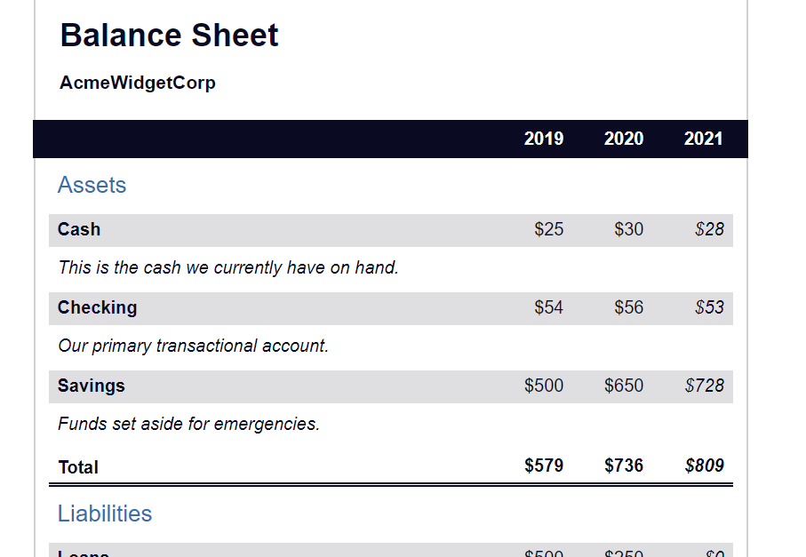

# Balance Sheet

This project is a web-based balance sheet that displays financial data in tables. It provides an overview of assets, liabilities, and net worth for a fictional company called AcmeWidgetCorp.

## Preview

## Features

The balance sheet is divided into three tables: Assets, Liabilities, and Net Worth.
Each table contains rows representing different financial categories.
The data is presented for three consecutive years: 2019, 2020, and 2021.
The current year is highlighted in the table.
Descriptions are provided for each financial category to provide additional context.
The total values for assets, liabilities, and net worth are displayed at the bottom of each table.

## Usage

To view the balance sheet, simply open the index.html file in a web browser.

## Customization

You can modify the financial data by editing the values in the table cells in the HTML file.
To change the company name or the balance sheet title, update the relevant elements in the HTML file.
To adjust the styles and layout, modify the styles.css file.

## Credits

This project was created by Philomena Kyalo. It is for educational purposes and can be used as a starting point for building more complex financial applications.

Feel free to customize and expand upon this project to suit your needs.

## License

This project is licensed under the MIT License.
