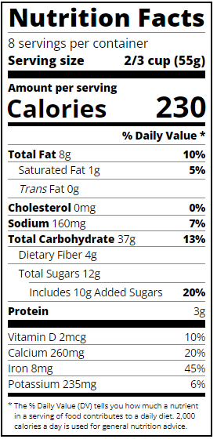

# Nutrition Label

This repository contains an HTML file and a CSS file that together create a nutrition label. The nutrition label displays information about the nutrition facts of a food product.

## Preview

#Usage

To use the nutrition label, follow these steps:

Clone the repository or download the HTML and CSS files.

Open the HTML file (index.html) in a web browser.

You should see the nutrition label displayed with the provided information about serving size, calories, daily values, and nutrient amounts.

## Credits

The nutrition label design and code were created by Philomena Kyalo.

