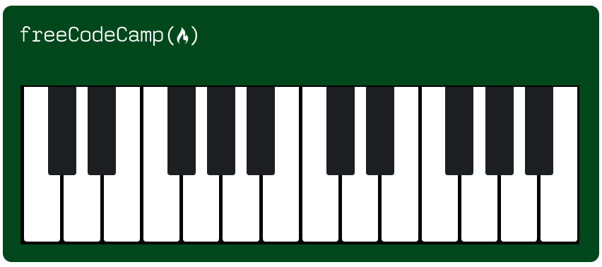

# Piano Interface

This is a simple piano interface created using HTML and CSS.

## Preview

## Getting Started

To use the piano interface, follow these steps:

1. Clone or download the repository to your local machine.
2. Open the `index.html` file in a web browser.
3. The piano interface will be displayed in the browser.

## Usage

- The piano interface consists of a set of keys representing piano notes.
- Clicking on the keys will produce the corresponding sound for each note.
- The white keys are represented by the elements with the class `.key`, and the black keys are represented by the elements with the class `.black--key`.
- The piano interface is responsive, adapting its size and layout based on the screen width. Different styles are applied for different screen sizes using media queries.

## Customization

If you wish to customize the piano interface, you can modify the CSS styles in the `styles.css` file. You can change the colors, dimensions, or add additional styling as per your requirements.

## Compatibility

The piano interface has been tested and verified to work on modern web browsers.

## Contributing

Contributions to improve the piano interface are welcome! If you find any issues or have suggestions for enhancements, please feel free to open an issue or submit a pull request.

## License

This project is licensed under the [MIT License](LICENSE).

